## Hey 👋, I'm johackim

**I am a French Indie Hacker 🇫🇷, I build free softwares (SaaS, JavaScript, Linux, Docker, Obsidian)**.

- 🔭 I’m currently working on [@ethibox](https://github.com/ethibox)
- 🌱 I’m currently learning a lot of things in my Obsidian vault
- ⚡ Fun fact: I created a popular french warez website at 16
- 👨‍💻 Learn more about me, on [johackim.com](https://johackim.com)
- 📫 How to reach me: [@_johackim](https://twitter.com/_johackim) or [mastodon.ethibox.fr/@johackim](https://mastodon.ethibox.fr/@johackim)

## Support me

I'd love to work on all my open-source projects, but my time on this earth is limited, support my work to give me more time!

Please support me with a one-time or a monthly donation and help me continue my activities.

